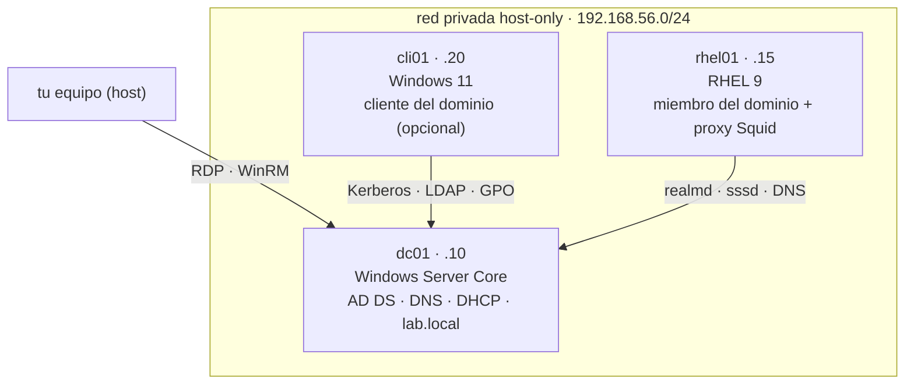
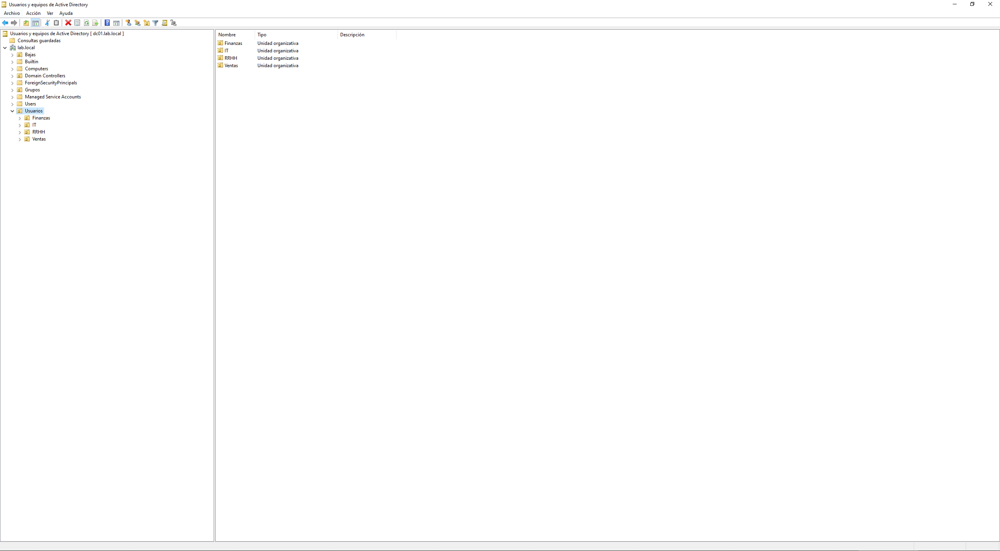
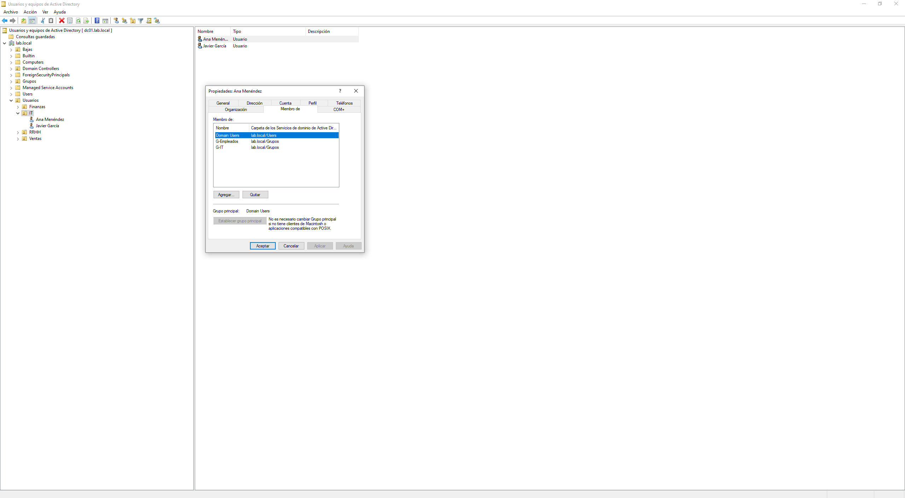
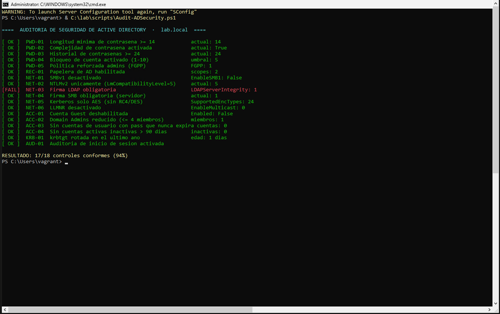
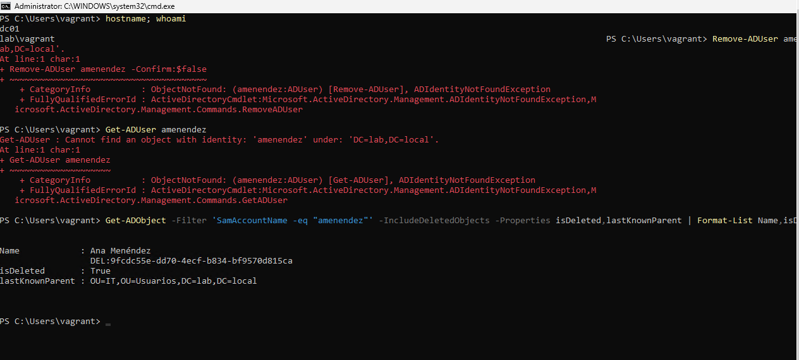
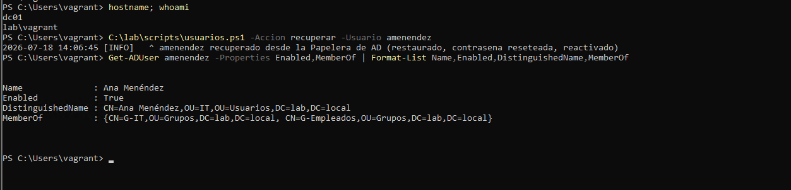
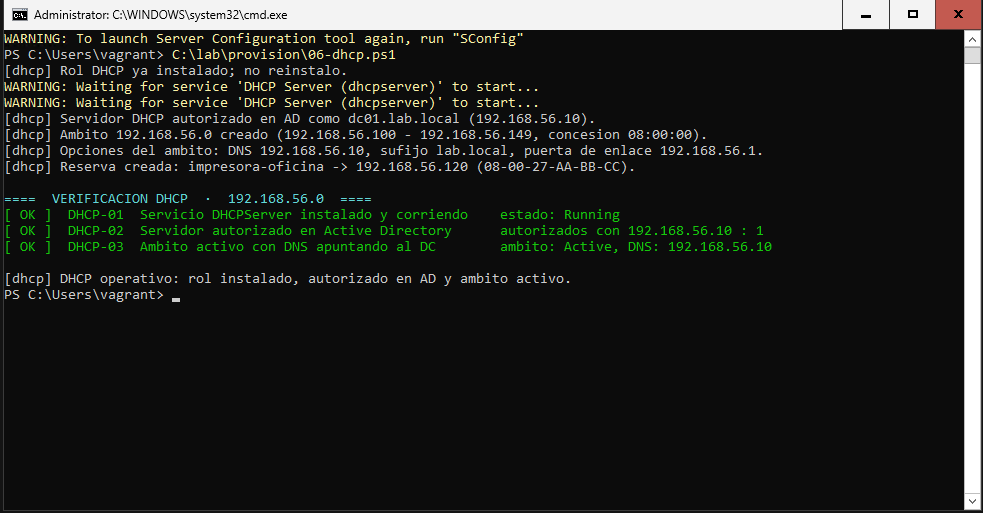
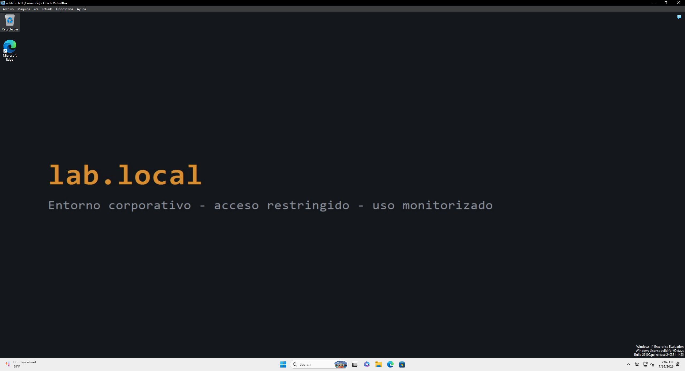

# activedirectory-lab

Laboratorio de Active Directory sobre Vagrant y VirtualBox. Un `vagrant up` levanta un Windows Server Core, lo promociona a controlador del bosque `lab.local` y deja el dominio montado por script: OUs, grupos, una GPO base, un recurso compartido y usuarios dados de alta desde un CSV. Sin tocar la interfaz gráfica.

Lo monté para practicar administración de AD como se hace de verdad, por código y repetible. Dar de alta treinta usuarios a clic no escala y no deja constancia de cómo se hizo.

Luego le fui pegando lo que pedía una oferta de técnico de sistemas: DHCP en el propio DC, un nodo RHEL unido al dominio y un proxy Squid autenticado contra el directorio.

`Vagrant` · `Windows Server 2025` · `Active Directory` · `PowerShell` · `DHCP` · `RHEL`

[](https://github.com/yosefnaabid/activedirectory-lab/actions/workflows/ci.yml)

> **Entorno de laboratorio. No usar en producción.** Las contraseñas son triviales a propósito y varias decisiones (DHCP en el DC, un solo controlador) valen para practicar pero no para un dominio real. El foco está en automatizar y demostrar.

## Índice

- [Topología](#topología)
- [Requisitos](#requisitos)
- [Levantarlo](#levantarlo)
- [Estructura](#estructura)
- [Usuarios](#usuarios)
- [Hardening y auditoría](#hardening-y-auditoría)
- [Recuperar una cuenta borrada](#recuperar-una-cuenta-borrada)
- [DHCP](#dhcp)
- [Nodo RHEL en el dominio](#nodo-rhel-en-el-dominio)
- [Proxy Squid](#proxy-squid)
- [GPOs y el cliente](#gpos-y-el-cliente)
- [Pruebas](#pruebas)
- [Problemas conocidos](#problemas-conocidos)
- [Notas](#notas)

## Topología

Todo cuelga de una red privada host-only. El DC es el centro: DNS, DHCP y directorio. El cliente Windows y el nodo RHEL se autentican contra él.



`cli01` y `rhel01` no arrancan con el `vagrant up` normal (el cliente pesa y RHEL no tiene box oficial). El DC va solo.

## Requisitos

- VirtualBox 7.2 o superior. La box de Windows Server 2025 trae firmware EFI/NVRAM que la 7.1 no importa bien.
- Vagrant.
- Unos 2 GB de RAM y 15 GB de disco para el DC. El cliente y el nodo RHEL suman lo suyo aparte.
- Para el nodo RHEL, la ISO de RHEL 9 (cuenta gratuita de Red Hat Developer).

## Levantarlo

```
vagrant up      # la primera vez baja la box, ~8 GB
```

El DC se promociona y se configura solo. Unos 10 minutos y dos reinicios. Al terminar, `lab.local` está en marcha con seis usuarios del CSV.

Hay un detalle feo que conviene saber. `vagrant up` no lo hace todo del tirón porque no puede: al promocionar, la cuenta local `vagrant` pasa a ser de dominio y Vagrant pierde la sesión WinRM a mitad de proceso. Lo resolví con una tarea programada. El script `01-controlador.ps1` instala el rol y registra una tarea que corre como SYSTEM en el siguiente arranque; esa tarea promociona y hace toda la post-configuración (OUs, GPO, altas). Como corre bajo SYSTEM, no depende de ninguna sesión remota.

Por lo mismo, las operaciones de después van con credenciales de dominio:

```powershell
$env:ADLAB_WINRM_USER = 'LAB\vagrant'

vagrant provision dc01 --provision-with informe     # estado del dominio
vagrant provision dc01 --provision-with altas       # re-alta desde el CSV
vagrant provision dc01 --provision-with baja        # baja de un usuario
vagrant provision dc01 --provision-with auditoria   # informe de seguridad
vagrant provision dc01 --provision-with hardening   # aplica el baseline
vagrant provision dc01 --provision-with dhcp        # instala y autoriza DHCP
```

También se puede entrar por RDP (`127.0.0.1:53389`, `vagrant`/`vagrant`) y trabajar desde `C:\lab\scripts`.

## Estructura

```
activedirectory-lab/
├── Vagrantfile
├── lab.psd1                      dominio, OUs, grupos, DHCP, contraseñas
├── provision/
│   ├── 01-controlador.ps1        instala AD DS y promociona lab.local
│   ├── 02-estructura.ps1         OUs, grupos, recurso Homes, GPO y alta inicial
│   ├── 03-seguridad.ps1          baseline de hardening
│   ├── 04-gpos.ps1               GPOs de usuario
│   ├── 05-cliente.ps1            une cli01 al dominio
│   ├── 06-dhcp.ps1               rol DHCP: autoriza en AD, ámbito, reserva
│   └── rhel/
│       ├── join-domain.sh        une el nodo RHEL con realmd/sssd
│       ├── squid.sh              proxy autenticado contra el dominio
│       └── blocked-domains.txt   dominios bloqueados por el proxy
├── scripts/
│   ├── usuarios.ps1              alta/baja/informe/recuperar
│   ├── auditoria.ps1             auditoría PASS/FAIL (solo lectura)
│   ├── Watch-ADSecurityEvents.ps1   vigía de eventos de seguridad
│   └── usuarios.csv              qué usuarios crear
├── tests/                        pruebas Pester (mockean AD)
└── docs/                         capturas y ADRs
```

## Usuarios

`usuarios.ps1` lleva el ciclo de vida completo: alta desde CSV, baja, informe y recuperación desde la Papelera. El alta crea por cada usuario su OU de departamento, el grupo, la cuenta y la carpeta personal en `\\dc01\Homes` con su ACL. La baja deshabilita la cuenta, la saca de todos los grupos, la mueve a la OU Bajas y anota la fecha en la descripción. Es idempotente, relanzarlo no duplica nada.

El CSV es una fila por persona con estas columnas: `Usuario,Nombre,Apellidos,Departamento,Puesto` (donde `Usuario` es el SamAccountName). `usuarios.csv` trae seis de ejemplo, cámbialo y relanza el alta.

```
PS> .\usuarios.ps1 -Accion alta -CsvPath .\usuarios.csv
  + amenendez creado  (Ana Menéndez, IT)
  + jgarcia   creado  (Javier García, IT)
  ...
  Alta terminada: 6 creado(s), 0 reincorporado(s), 0 sin cambios.

PS> .\usuarios.ps1 -Accion baja -Usuario amenendez
  - amenendez dado de baja (deshabilitado, sin grupos, movido a Bajas)
```

El dominio desde ADUC, con las OUs por departamento y los usuarios del CSV:



Un usuario creado por el script, con sus grupos (`Domain Users`, `G-Empleados`, `G-IT`):



## Hardening y auditoría

Un DC recién promocionado se queda con los valores por defecto de Windows, y no son seguros: NTLMv1 aceptado, SMBv1 activo, Kerberos con RC4, LLMNR encendido, contraseñas cortas.

`auditoria.ps1` repasa 18 controles alineados con el CIS Benchmark de Windows Server 2022 (contraseñas, bloqueo, FGPP, Papelera de AD, SMBv1, NTLMv2, firma SMB y LDAP, Kerberos AES, LLMNR, cuenta Guest, miembros de Domain Admins, antigüedad de krbtgt, auditoría avanzada) y saca un informe PASS/FAIL con su porcentaje. Es de solo lectura, y devuelve como código de salida el número de controles fallidos, para poder consumirlo desde una pipeline.

`03-seguridad.ps1` aplica el baseline. Cada control va en su propio try/catch, así un fallo aislado no tumba el resto.

El flujo que uso: audito el DC recién montado (sale sobre el 50% de conformidad), aplico el hardening y vuelvo a auditar. Sube a 18/18.

El control que más guerra dio fue la firma LDAP obligatoria (NET-03). En un DC ese valor no lo fija cualquier GPO: lo gobierna la Default Domain Controllers Policy por sus security settings, que ganan a una GPO de registro aunque la enlaces como enforced. Para forzarlo hay que bajar a la plantilla de seguridad y escribir `LDAPServerIntegrity=2` en el `GptTmpl.inf` de esa política dentro del SYSVOL, y luego `gpupdate /force`. Con eso el control cierra. El razonamiento largo, con lo que probé antes y no funcionó, está en `docs/adr/0002-firma-ldap-por-gpttmpl.md`.



Hay también un `Watch-ADSecurityEvents.ps1` que resume los eventos que importan del log de seguridad (4728/4732 alta en grupo, 4740 bloqueo, 4625 fallo de login, 4662 acceso a replicación) y marca alerta cuando alguien toca un grupo privilegiado. El 4662 lo filtra por cuentas de máquina, que replican entre sí de forma legítima, para no ahogarse en ruido.

## Recuperar una cuenta borrada

El hardening habilita la Papelera de AD. `usuarios.ps1 -Accion recuperar` la usa: localiza el objeto borrado por su SamAccountName, lo restaura con `Restore-ADObject`, resetea la contraseña y reactiva la cuenta. Restaurar en vez de recrear conserva el SID, así que la carpeta personal sigue siendo suya sin tocar ni una ACL.

Borrada, `Get-ADUser` ya no la encuentra y solo queda en la Papelera con su `lastKnownParent`:



Recuperada, habilitada, en su OU y con sus grupos otra vez:



## DHCP

`06-dhcp.ps1` añade el rol al DC, lo autoriza en AD con `Add-DhcpServerInDC`, crea el ámbito de la red del lab con el DNS del dominio como opción y mete una reserva de ejemplo. Todo declarado en `lab.psd1`, idempotente, y termina con su propia verificación PASS/FAIL.

```powershell
vagrant provision dc01 --provision-with dhcp
```



Una cosa que me costó pillar: autorizar el servidor en AD pide Enterprise Admins, no basta con Domain Admins, porque el registro de autorización vive en la partición de Configuración del bosque (`CN=NetServices`), no en el dominio. La cuenta `vagrant` es Domain Admin, así que `02-estructura.ps1` la mete en Enterprise Admins; si aun así faltara, `06-dhcp.ps1` avisa con las instrucciones en lugar de morir con un `WIN32 5` que no dice nada.

## Nodo RHEL en el dominio

Un miembro Linux de verdad (RHEL 9, no un derivado), unido a `lab.local` con realmd y sssd. A partir de ahí los usuarios y grupos de AD sirven para iniciar sesión, para los permisos y para el sudo, sin cuentas locales duplicadas.

`provision/rhel/join-domain.sh` hace la configuración entera y es idempotente: fija IP estática y DNS al DC, instala realmd/sssd/adcli/oddjob, une con `realm join` (las credenciales van por variable de entorno, no en el código), ajusta sssd (nombres cortos, home creado en el primer login) y da sudo al grupo de AD `G-LinuxAdmins`. Al final imprime `realm list`, un `id` de un usuario del dominio y el estado de sssd.

Esta VM es la única que no levanta Vagrant. Red Hat no publica boxes oficiales, así que la creo a mano desde la ISO (cuenta gratuita de Red Hat Developer) y la registro con `subscription-manager`. La receta está en `provision/rhel/README.md` y el motivo de dejarla fuera de Vagrant en `docs/adr/0008-nodo-rhel-sin-box-oficial.md`.

## Proxy Squid

Sobre ese mismo nodo RHEL, `provision/rhel/squid.sh` monta un Squid autenticado contra el dominio (Basic vía PAM y sssd). Sale a internet solo quien esté en el grupo de AD `G-ProxyUsers`, hay una lista de dominios vetados en `blocked-domains.txt` y cada acceso queda en el log con el usuario que lo hizo.

```
curl -x http://192.168.56.15:3128 http://example.com -I               # 407, sin credenciales
curl -x http://192.168.56.15:3128 -U amenendez http://example.com -I   # 200, es de G-ProxyUsers
curl -x http://192.168.56.15:3128 -U mruiz http://example.com -I       # 403, autentica pero sin grupo
```

Usé Basic y no Kerberos/Negotiate a propósito: reaprovecha la unión al dominio sin keytabs ni SPN. El trade-off (Basic manda usuario y contraseña en base64 en cada petición, en producción sería Negotiate o al menos Basic sobre TLS) está en `docs/adr/0009-proxy-basic-sobre-sssd.md`.

## GPOs y el cliente

`04-gpos.ps1` crea las GPOs de usuario: panel de control restringido, fondo corporativo y una unidad H: mapeada por grupo. `05-cliente.ps1` une un Windows 11 (`cli01`, no arranca por defecto porque pesa) para ver las políticas aplicadas sobre un usuario real.



## Pruebas

Pester mockea Active Directory y prueba la lógica de `usuarios.ps1` sin necesitar un DC ni RSAT (alta idempotente, ACL de la carpeta personal, baja, recuperación desde la Papelera, `-WhatIf`). PSScriptAnalyzer linta todos los scripts. Las dos cosas corren en GitHub Actions en cada push.

## Problemas conocidos

- **WinRM se corta al promocionar el DC.** Vagrant pierde la reconexión porque la cuenta local pasa a ser de dominio a mitad de promoción. Por eso la promoción y la post-configuración van en una tarea SYSTEM, no en el provisioner. Detalle en [Levantarlo](#levantarlo) y en `docs/adr/0001`.
- **Autorizar DHCP pide Enterprise Admins**, no basta con Domain Admins. El lab lo resuelve solo metiendo a `vagrant` en el grupo; si faltara, el script te lo dice. Ver [DHCP](#dhcp).
- **Acentos rotos en la consola.** Los `.ps1` tienen que ir en UTF-8 con BOM, o Windows PowerShell 5.1 se come las tildes.
- **El nodo RHEL no sale con `vagrant up`.** No hay box oficial de RHEL; la VM se crea a mano una vez. Ver [Nodo RHEL](#nodo-rhel-en-el-dominio).
- **El DHCP de VirtualBox estorba.** La red host-only trae su propio servidor DHCP. Si quieres ver al DC repartir concesiones de verdad, apágalo antes (`VBoxManage dhcpserver modify ... --disable`).

## Notas

- Contraseñas triviales a propósito: `vagrant`, DSRM `LabDSRM.2026`, usuarios `Bienvenid@.2026`.
- Las decisiones no obvias (la tarea SYSTEM, la firma LDAP, la ACL por SID, el nodo RHEL fuera de Vagrant, Basic en el proxy) están anotadas en `docs/adr/`.
- `vagrant destroy -f` lo borra todo.
- TODO: un segundo DC para probar replicación y traspaso de roles FSMO. Lo tuve a medias y lo saqué para no dejar algo sin verificar en el repo; lo retomo cuando tenga RAM de sobra en el portátil.
